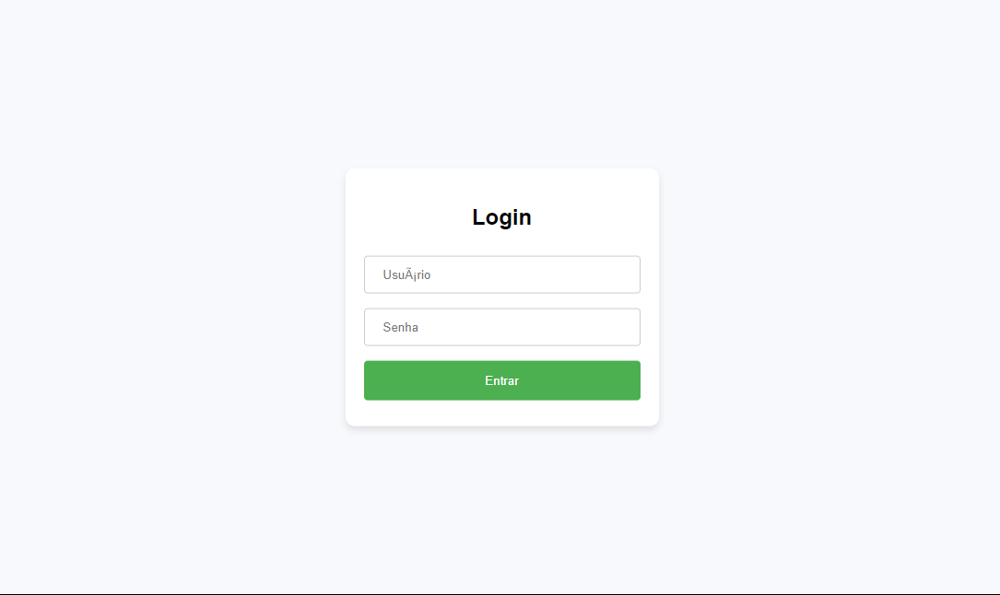
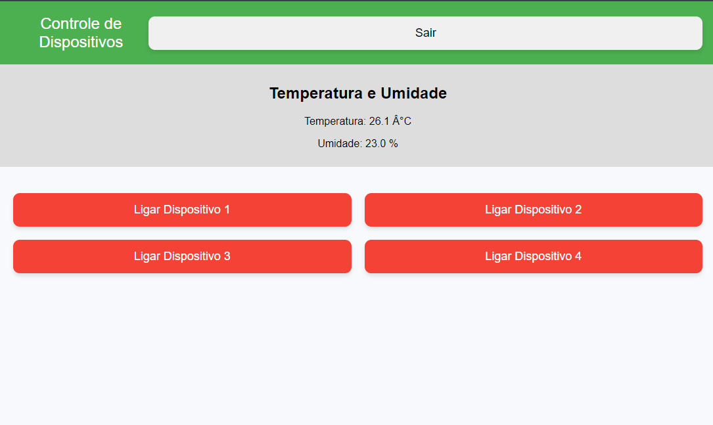
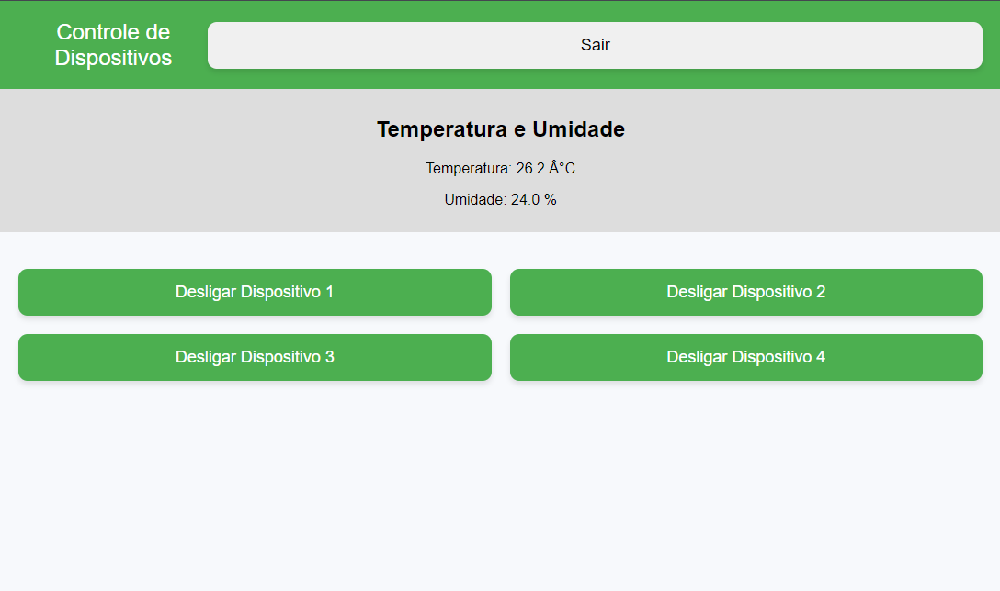

# Automação Residencial com ESP32 e Sensor DHT11 Via Servidor Local

Este é um projeto de automação residencial utilizando um ESP32, sensores DHT11 para monitoramento de temperatura e umidade, e controle de dispositivos eletrônicos via um servidor web local. Este projeto permite o controle de dispositivos através de uma interface web, acessível por dispositivos conectados à mesma rede Wi-Fi.

## Configuração Inicial

### Rede Wi-Fi
Inicialmente é necessário alterar o nome e senha da rede WiFi de acordo com a rede local a ser conectada, substituindo ``REPLACE_WITH_YOUR_SSID`` para o nome e ``REPLACE_WITH_YOUR_PASSWORD`` para a senha.

```cpp
const char* ssid = "REPLACE_WITH_YOUR_SSID";
const char* password = "REPLACE_WITH_YOUR_PASSWORD";
```

### Definição de Pinos
Defina os pinos utilizados para os dispositivos e botões táteis:

```cpp
#define DHTPIN 27
#define DHTTYPE DHT11

const int numDevices = 4;
const int numTouchButtons = 3;

const int devicePins[numDevices] = { 18, 19, 23, 5 };
const int touchButtonPins[numTouchButtons] = { 13, 12, 14 };
```

### Estado Inicial dos Dispositivos
Configure o estado inicial dos dispositivos e os valores medianos dos botões táteis:

```cpp
bool deviceStates[numDevices] = { LOW, LOW, LOW, LOW };
bool lastTouchStates[numTouchButtons] = { LOW, LOW, LOW };

const int capacitanceThreshold = 20;
int touchMedians[numTouchButtons] = { 0, 0, 0 };
```

### Credenciais de Login
Defina as credenciais padrão para acesso à interface web:

```cpp
bool loggedIn = false;
const char* defaultUsername = "admin";
const char* defaultPassword = "admin";
```

### Variáveis de Sensor
Inicialize as variáveis para armazenar os dados do sensor de temperatura e umidade:

```cpp
float currentTemperature = 0.0;
float currentHumidity = 0.0;
```

## Código HTML da Interface Web

### Página Principal
```cpp
const char HTML_PAGE[] PROGMEM = R"rawliteral(
<!DOCTYPE html>
<html>
<head>
<meta name="viewport" content="width=device-width, initial-scale=1">
<style>
body { font-family: Arial, sans-serif; text-align: center; margin: 0; padding: 0; background-color: #f7f9fc; }
header { background-color: #4CAF50; color: white; padding: 20px; font-size: 24px; display: flex; justify-content: space-between; align-items: center; }
.grid { display: flex; flex-wrap: wrap; justify-content: center; padding: 10px; }
.grid-item { flex: 1 1 calc(50% - 20px); box-sizing: border-box; margin: 10px; }
button { width: 100%; padding: 15px; font-size: 18px; border: none; border-radius: 10px; box-shadow: 0 4px 6px rgba(0, 0, 0, 0.1); cursor: pointer; transition: all 0.3s ease; }
button:active { box-shadow: 0 2px 3px rgba(0, 0, 0, 0.2); }
.on { background-color: #4CAF50; color: white; }
.off { background-color: #f44336; color: white; }
.sensor { background-color: #ddd; padding: 10px; margin-bottom: 20px; }
</style>
</head>
<body>
<header>Controle de Dispositivos
<button onclick="location.href='/logout'">Sair</button>
</header>
<div class="sensor">
<h2>Temperatura e Umidade</h2>
<p>Temperatura: <span id="temperature">%TEMPERATURE%</span> °C</p>
<p>Umidade: <span id="humidity">%HUMIDITY%</span> %</p>
</div>
<div class="grid">
%BUTTONS%
</div>
<script>
let ws = new WebSocket('ws://' + window.location.hostname + ':81');
ws.onmessage = function(event) {
  let data = JSON.parse(event.data);
  for (let i = 0; i < %NUM_DEVICES%; i++) {
    let btn = document.getElementById('toggleBtn' + i);
    if (data.deviceStates[i]) {
      btn.classList.add('on');
      btn.classList.remove('off');
      btn.textContent = 'Desligar Dispositivo ' + (i+1);
    } else {
      btn.classList.add('off');
      btn.classList.remove('on');
      btn.textContent = 'Ligar Dispositivo ' + (i+1);
    }
  }
  document.getElementById('temperature').textContent = data.temperature.toFixed(1);
  document.getElementById('humidity').textContent = data.humidity.toFixed(1);
};
function toggleDevice(index) {
  ws.send(index.toString());
}
</script>
</body>
</html>
)rawliteral";
```

### Página de Login
```cpp
const char LOGIN_PAGE[] PROGMEM = R"rawliteral(
<!DOCTYPE html>
<html>
<head>
<meta name="viewport" content="width=device-width, initial-scale=1">
<style>
body { font-family: Arial, sans-serif; text-align: center; margin: 0; padding: 0; background-color: #f7f9fc; }
.login-container { position: absolute; top: 50%; left: 50%; transform: translate(-50%, -50%);
                   width: 300px; padding: 20px; background-color: #fff; border-radius: 10px; box-shadow: 0 4px 8px rgba(0, 0, 0, 0.1); }
input[type=text], input[type=password] { width: 100%; padding: 12px 20px; margin: 8px 0; display: inline-block;
                                         border: 1px solid #ccc; border-radius: 4px; box-sizing: border-box; }
input[type=submit] { width: 100%; background-color: #4CAF50; color: white; padding: 14px 20px; margin: 8px 0;
                    border: none; border-radius: 4px; cursor: pointer; }
input[type=submit]:hover { background-color: #45a049; }
</style>
</head>
<body>
<div class="login-container">
<h2>Login</h2>
<form action="/login" method="POST">
<input type="text" name="username" placeholder="Usuário">
<br>
<input type="password" name="password" placeholder="Senha">
<br>
<input type="submit" value="Entrar">
</form>
</div>
</body>
</html>
)rawliteral";
```

## Funções de Configuração

### Setup
A função `setup` é responsável por inicializar os componentes do sistema, incluindo sensores, dispositivos e a conexão Wi-Fi.

```cpp
void setup() {
  Serial.begin(115200);
  dht.begin();
  setupDevices();
  setupTouchButtons();
  setupWiFi();
  setupServer();
  sensorTicker.attach(1, updateSensorData);
}
```

### Loop
A função `loop` mantém o servidor web e o servidor de WebSocket em execução contínua, além de ler os botões táteis.

```cpp
void loop() {
  server.handleClient();
  webSocket.loop();
  readTouchButtons();
}
```

## Funções Auxiliares

### Atualização de Dados do Sensor
Esta função lê os dados do sensor DHT11 e os armazena nas variáveis apropriadas.

```cpp
void updateSensorData() {
  currentTemperature = dht.readTemperature();
  currentHumidity = dht.readHumidity();

  if (isnan(currentTemperature) || isnan(currentHumidity)) {
    Serial.println("Falha ao ler o sensor DHT11!");
    currentTemperature = 0;
    currentHumidity = 0;
  }

  if (loggedIn) {
    notifyClients();
  }
}
```

### Configuração de Dispositivos
Configura os pinos dos dispositivos e restaura o estado salvo dos dispositivos.

```cpp
void setupDevices() {
  for (int i = 0; i < numDevices; i++) {
    pinMode(devicePins[i], OUTPUT);
    digitalWrite(devicePins[i], HIGH);
    deviceStates[i] = LOW;
  }

  preferences.begin("deviceStates", false);
  for (int i = 0; i < numDevices; i++) {
    deviceStates[i] = preferences.getBool(String("device" + String(i)).c_str(), false);
    digitalWrite(devicePins[i], deviceStates[i] ? LOW : HIGH);
  }
}
```

### Configuração dos Botões Táteis
Configura os pinos dos botões táteis e calcula os valores medianos.

```cpp
void setupTouchButtons() {
  for (int i = 0; i < numTouchButtons; i++) {
    touchMedians[i] = getTouchMedian(touchButtonPins[i]);
  }
}
```

### Conexão Wi-Fi
Conecta o ESP32 à rede Wi-Fi especificada.

```cpp
void setupWiFi() {
  WiFi.begin(ssid, password);
  Serial.print("Conectando a ");
  Serial.println(ssid);

  while (WiFi.status() != WL_CONNECTED) {
    delay(500);


    Serial.print(".");
  }

  Serial.println("");
  Serial.println("Conectado à rede Wi-Fi");
  Serial.print("Endereço IP: ");
  Serial.println(WiFi.localIP());
}
```

### Servidor Web
Configura o servidor web e o servidor de WebSocket.

```cpp
void setupServer() {
  server.on("/", HTTP_GET, [](AsyncWebServerRequest *request) {
    if (!loggedIn) {
      request->send_P(200, "text/html", LOGIN_PAGE);
    } else {
      request->send_P(200, "text/html", HTML_PAGE, processor);
    }
  });

  server.on("/login", HTTP_POST, [](AsyncWebServerRequest *request) {
    if (request->hasParam("username", true) && request->hasParam("password", true)) {
      String username = request->getParam("username", true)->value();
      String password = request->getParam("password", true)->value();
      if (username == defaultUsername && password == defaultPassword) {
        loggedIn = true;
        request->redirect("/");
      } else {
        request->redirect("/");
      }
    } else {
      request->send(400, "text/plain", "Parâmetros inválidos");
    }
  });

  server.on("/logout", HTTP_GET, [](AsyncWebServerRequest *request) {
    loggedIn = false;
    request->redirect("/");
  });

  server.begin();

  webSocket.begin();
  webSocket.onEvent(onWebSocketEvent);
}
```

### Leitura dos Botões Táteis
Lê os valores dos botões táteis e alterna o estado dos dispositivos correspondentes.

```cpp
void readTouchButtons() {
  for (int i = 0; i < numTouchButtons; i++) {
    int touchValue = touchRead(touchButtonPins[i]);

    if (touchValue < touchMedians[i] - capacitanceThreshold) {
      if (!lastTouchStates[i]) {
        lastTouchStates[i] = true;
        toggleDevice(i);
      }
    } else {
      lastTouchStates[i] = false;
    }
  }
}
```

## 🖼️ Ao final teremos algo assim:**
### Tela de Login


### Tela de controle (Dispositivos ligados)


### Tela de controle (Dispositivos ligados)


## 🗂️ Bibliotecas usadas
- 📁 [WiFi Versão 1.2.7](https://www.arduino.cc/reference/en/libraries/wifi/)
- 📁 []()
